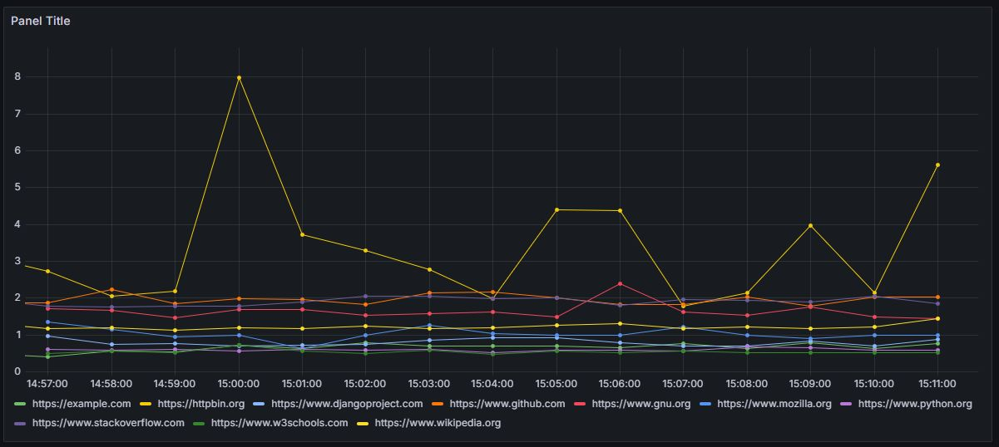

# Page load time monitor
### 📝 Overview

Service that measures real page load times using Playwright (headless Chromium), exports metrics to Prometheus, and enables visualization and alerting through Grafana. Unlike simple ping or HTTP checks, this project uses a real browser engine (Playwright) to fully load pages, including JavaScript execution and resource fetching, providing a true measurement of page performance as experienced by real users.


---
### ✨ Features
* Real browser-based page load time monitoring.
* Independent browser sessions for each request (no cache/cookies).
* Metrics export to Prometheus (page_load_time_seconds).
* Configurable request frequency and timeouts.
* Smooth spreading of requests across the monitoring interval.
* Webhook proxy service for passing alerts in external integrations.

### 🛠️ Tech Stack
* Python 3.12
* Playwright (Chromium)
* Prometheus
* Grafana
* FastAPI (webhook_proxy)
* Docker + Docker Compose

### 📂 Project Structure
```
page_mon/             # Page load monitoring service
webhook_proxy/        # FastAPI webhook proxy
grafana_setup/        # Grafana dashboards, alerting, datasources
docker-compose.yml    # Docker orchestration
prometheus.yml        # Prometheus configuration
.env                  # Environment variables
README.md             # Project description
```

### ⚙️ Environment Variables
```
URLS                # List of URLs to monitor (newline separated)
TIMEOUT	            # Page load timeout (seconds)
FREQUENCY           # Monitoring cycle duration (seconds)
HOOK_ADDRESS        # Target address for webhook forwarding
ENABLE_CONSOLE_LOG  # Enable console logging (True/False)
TELEGRAM_BOT_TOKEN  # Telegram bot token for Grafana alerts
TELEGRAM_CHAT_ID    # Telegram chat ID for alerts
```

### 🚀 How to Run
_All services are launched via Docker Compose._

1. Clone the repository and configure .env file from .env.sample
2. Build and start all containers:
```
docker-compose up --build -d
```
Access Grafana at:
```
http://<yourhost>:3000  # or port from your env config
```

### 📢 Alerts & Notifications
You can configure alerting in Grafana to:
* 🔔 Send alerts to Telegram using the provided TELEGRAM_BOT_TOKEN and TELEGRAM_CHAT_ID.
* 🔔 Send alerts to any webhook endpoint using the built-in webhook proxy service (HOOK_ADDRESS).
   * Alerting rules and contact points are preconfigured and also can be customized via Grafana UI. 
   * If your service requires specific JSON fields of hooks, you can use the provided FastAPI-based webhook proxy (fast_api_proxy.py) and implement transformation there.
It receives the standard Grafana webhook, adapts the payload, and forwards it in a new format to your target endpoint.
